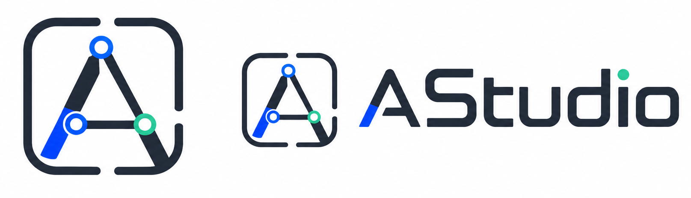

<p align="center">
  
</p>

# AStudio

<p align="center">
  <strong>本地优先的多 Agent 协作任务执行工作台</strong>
</p>

<p align="center">
  中文
  ·
  <a href="./README.en.md">English</a>
</p>

<p align="center">
  <a href="./LICENSE">MIT License</a>
  ·
  <a href="./docs/architecture.md">架构文档</a>
  ·
  <a href="./docs/studio-system.md">Studio 体系</a>
  ·
  <a href="./docs/desktop-distribution.md">桌面端分发</a>
  ·
  <a href="./CONTRIBUTING.md">参与贡献</a>
</p>

AStudio 把一次复杂请求拆成可路由、可审批、可执行、可追踪、可复用的任务流水线。用户提交需求后，Agent Zero 先判断任务类型：可直接回答的简单问题会快速结束；平台管理类请求会进入 Studio 0；业务任务会复用已有 Studio，或创建新的专业工作室。Studio Leader 负责澄清需求、生成 DAG 执行计划、分配 Sub-agent、质检产出；Sub-agent 使用 Skill、附件工具、搜索工具和任务沙箱完成具体步骤。任务结束后，系统再进行结果汇总、成本记录和记忆沉淀。

项目当前适合本地运行、二次开发和早期桌面端预览。模型密钥、任务数据库、附件、沙箱产物和运行日志都保存在本机，默认不会提交到仓库。

## 核心能力

- **任务编排引擎**：从 `/api/tasks/ask` 创建任务，后台 worker 进程负责路由、规划和执行，FastAPI 主进程保持响应。
- **Agent Zero 路由层**：根据 Studio Card、系统管理分类器和兜底规则，将任务分配给已有 Studio、Studio 0，或触发新 Studio 创建。
- **Studio 工作室模型**：每个 Studio 拥有场景描述、能力标签、近期话题、用户事实、Leader 和多名 Sub-agent。
- **DAG 执行计划**：Leader 输出带 `id`、`depends_on`、`assign_to_role` 的步骤，后端校验依赖、修剪环路，并并发执行可并行节点。
- **审批与澄清**：需求不完整时进入 `need_clarification`；执行前进入 `await_leader_plan_approval`，用户可以批准或要求重新规划。
- **Leader 质检闭环**：Sub-agent 提交 deliverable 后先进入 `pending_review`，Leader 可接受或打回重做，超过重试上限后保留最后结果。
- **Skill 池与动态招聘**：内置文件、搜索、代码、沙箱、定时任务等工具；支持从 SkillHub / ClawHub 导入 bundle skill，也支持 AI 生成本地 Skill。
- **任务沙箱**：每个任务可拥有独立目录和端口，支持写文件、运行命令、保存日志、启动预览链接和保留工具型产物。
- **附件分析**：上传 Excel/CSV、PDF、图片和文本后，任务会自动获得附件读取、表格预览、PDF 抽文本和图片元数据工具。
- **人类介入与级联重算**：用户可以重试阻塞节点，也可以手动编辑某步输出，系统会按依赖关系重跑下游步骤。
- **长期记忆沉淀**：任务完成后，经验会写回参与员工的 `soul`，Studio Card 会更新近期话题、能力标签和用户事实。
- **可观测与恢复**：SSE 推送任务状态、节点增量、心跳和运行进度；watchdog 会处理长时间无进展的任务，保留原方案以便重跑。
- **桌面端路线**：Electron 已支持本地后端拉起、动态端口、用户数据目录、sidecar 查找和 GitHub Releases 预览打包。

## 使用流程

### 1. 配置模型

CLI 很适合开发者，但面向普通用户时，AStudio 选择把模型配置放进图形界面。首次启动后，在左侧设置里添加 Provider、API Key、模型列表和不同角色使用的模型。


### 2. 提交任务，补充必要信息

当任务描述太宽泛时，Leader 会先列出需要补充的问题。用户补充后，系统会把原始需求和澄清答案合并，再生成新的执行计划。


### 3. 审批执行计划

Leader 会把任务拆成多个步骤，标明执行角色和依赖关系。用户可以先查看计划，再决定开始执行；也可以给出反馈，让 Leader 重新规划。


### 4. 由 Studio 接管任务

Studio 面向具体场景沉淀经验。Agent Zero 会根据 Studio Card 做路由，已有工作室能处理时优先复用；没有合适工作室时，会创建新的专业工作室。


### 5. Sub-agent 执行 DAG

真正执行任务的是 Sub-agent。Leader 将步骤分配给不同角色，后端按 DAG 依赖启动节点；某个上游节点阻塞时，下游节点会被级联跳过，用户补充信息后可从阻塞点恢复。


Sub-agent 的 `agent.md`、`soul` 和 Skills 都可以编辑。稳定任务场景可以沉淀为固定角色，而临时缺少的能力也可以由 Leader 触发“招聘”流程补充。


### 6. 查看结果、批注和沙箱产物

文本结果支持批注式追问，适合在长结论里针对局部内容继续讨论。


如果任务生成了代码、页面、脚本或转换工具，产物会保留在任务沙箱里。用户可以查看文件、运行命令、打开预览，也可以把结果作为后续任务的基础。


## 系统架构

AStudio 的核心链路可以概括为四层：

| 层级 | 主要职责 | 相关模块 |
| --- | --- | --- |
| 桌面与前端层 | Electron 桌面壳、React 界面、任务看板、Studio 管理、沙箱文件、Skill 池、SSE 状态订阅 | `web/`、`web/electron/main.cjs` |
| API 与状态层 | FastAPI 路由、SQLite/WAL、本地配置、附件保存、任务/Studio/Sandbox/Schedule 存储 | `server/main.py`、`server/routers/`、`server/storage/` |
| 编排执行层 | Agent Zero 路由、Leader 规划、DAG 调度、Sub-agent ReAct 执行、Leader 质检、最终汇总 | `server/agents/`、`server/routers/task.py` |
| 工具与记忆层 | Skill Registry、内置工具、bundle skill、沙箱命令、搜索、附件分析、定时任务、soul 和 Studio Card 沉淀 | `server/tools/`、`server/core/`、`server/services/` |

### 任务生命周期

1. 用户创建任务，后端写入 `tasks` 和初始 iteration。
2. 隔离 worker 进程开始执行，避免长任务阻塞 API 主进程。
3. Agent Zero 做任务路由：系统管理、直接回答、复用 Studio、创建 Studio。
4. Studio Leader 生成计划；计划可能要求澄清，也可能等待用户审批。
5. 用户批准后，后端按 DAG 创建 UI 节点和边，依赖满足的步骤并发执行。
6. Sub-agent 使用工具执行任务，通过 `submit_task_deliverable` 或 `report_system_blocker` 上报结果。
7. Leader 对每步产出做质量审查，必要时打回修订。
8. 所有步骤结束后，Leader 汇总 findings，Agent Zero 生成最终答复。
9. Task Monitor 写回最终状态，并触发员工 `soul`、Studio Card 和用户事实更新。

### 可靠性设计

- **进程隔离**：默认每条任务流水线由 `workers.task_worker` 独立执行，异常退出会被标记到任务状态。
- **任务锁与终止**：同一任务避免重复编排；用户终止会取消运行中的 coroutine 和 worker。
- **SSE 增量推送**：前端通过 `/api/tasks/{task_id}/stream` 接收状态、节点、心跳和暂停事件。
- **watchdog**：长期无活动的 planning / executing 任务会被自动标记为失败或终止，已保存计划可重新执行。
- **成本与耗时记录**：每个 SubTask 记录 tokens、duration、cost 和模型名，方便后续观察不同角色的消耗。
- **安全执行边界**：沙箱命令经过本地执行安全校验，文件操作限制在任务沙箱路径内。

## 文档入口

README 只放项目主线。更细的设计说明放在 `docs/` 中：

| 文档 | 内容 |
| --- | --- |
| [整体架构设计](./docs/architecture.md) | Agent Zero、Studio、Canvas 的整体分层 |
| [Studio 体系架构](./docs/studio-system.md) | Studio Card、Soul、Agent.md 和实例化逻辑 |
| [Agent Zero 设计](./docs/agent-zero.md) | 路由、拆解、汇总和工作室晋升 |
| [Canvas Engine](./docs/canvas-engine.md) | React Flow、SSE、节点状态和画布交互 |
| [上下文蒸馏](./docs/context-distillation.md) | 节点摘要、长期记忆和上下文压缩 |
| [LLM 集成策略](./docs/llm-integration.md) | LiteLLM、角色模型路由和热加载 |
| [桌面端分发计划](./docs/desktop-distribution.md) | Electron、sidecar、Release 阶段和分发取舍 |

## 技术栈

- **前端**：React 19、TypeScript、Vite、React Router、Zustand、React Flow、Lucide Icons
- **后端**：FastAPI、Pydantic、SQLite WAL、SSE、LiteLLM、Playwright、uv
- **编排**：Agent Zero、Studio Leader、Sub-agent ReAct、Skill Registry、任务 worker、watchdog
- **桌面端**：Electron、electron-builder、PyInstaller sidecar 预览链路
- **包管理**：pnpm workspace、uv

## 安装

### 环境要求

- Node.js 20+
- pnpm 8+，建议通过 Corepack 启用
- Python 3.11+
- uv

macOS 可以使用 Homebrew 安装 uv：

```bash
brew install uv
```

### 获取项目并安装依赖

```bash
git clone <your-repo-url>
cd <repo-dir>
corepack enable
pnpm setup
```

`pnpm setup` 会完成：

- 安装根目录和前端 Node 依赖；
- 进入 `server/` 执行 `uv sync`；
- 安装 Playwright Chromium，作为浏览器检索的兜底能力。

### 启动开发环境

```bash
pnpm dev
```

启动后访问：

- Web 界面：http://127.0.0.1:5173
- 后端健康检查：http://127.0.0.1:8000/api/health

### 启动本地稳定模式

```bash
pnpm start
```

该命令会先构建前端，再由 FastAPI 托管 `web/dist`。启动后访问：

- AStudio：http://127.0.0.1:8000

### 启动 Electron

开发调试：

```bash
pnpm electron:dev
```

本地稳定入口：

```bash
pnpm electron:start
```

Electron 会优先复用健康的本地后端；没有可用后端时会启动 FastAPI。桌面打包态默认使用空闲端口，数据写入 Electron 用户数据目录，后端日志写入 `logs/backend.log`。

## 模型与搜索配置

首次启动后，可以在左侧设置中配置模型；也可以复制示例文件后手动编辑：

```bash
mkdir -p data
cp config.example.yaml data/config.yaml
```

模型配置由三部分组成：

- `llm_providers`：供应商名称、API Key、Endpoint、模型列表、展示名和 OAuth 标记。
- `model_aliases`：把 AStudio 内部模型名映射到供应商真实模型 ID，适合 OpenAI 兼容网关。
- `model_assignment`：为 `agent_zero`、`sub_agents`、`distillation` 分配模型、推理强度和思考模式；Studio Leader 当前复用 `agent_zero` 配置。

### 模型配置原则

- `name` 是 AStudio 内部使用的 Provider 名称，也会作为角色分路里的前缀，例如 `deepseek/deepseek-chat`。
- `litellm_provider` 是 LiteLLM 实际路由前缀。使用 OpenAI 兼容网关时，`name` 可以写成 `siliconflow`、`oneapi` 等自定义名称，但 `litellm_provider` 通常要写 `openai`。
- `models` 是界面里可选的本地模型名。可以写短名，例如 `qwen-max`；保存后系统会按 `Provider Name/模型名` 作为本地引用。
- `model_aliases` 用于“界面展示的本地模型名”和“真实调用模型 ID”不一致的情况。调用 LiteLLM 时会使用真实模型 ID。
- `model_display_names` 只影响界面和任务记录展示，不影响实际调用。
- `model_assignment.*.model` 建议使用 `Provider Name/模型名`，避免多个 Provider 下模型短名重复。

简单 API Key Provider 示例：

```yaml
llm_providers:
  - name: deepseek
    api_key: "sk-..."
    endpoint: null
    models:
      - deepseek-chat
      - deepseek-coder
    model_aliases: {}
    model_display_names: {}
    is_oauth: false

model_assignment:
  agent_zero:
    model: deepseek/deepseek-chat
    reasoning_effort: high
    thinking_type: default
    thinking_budget_tokens: null
  sub_agents:
    model: deepseek/deepseek-chat
    reasoning_effort: low
    thinking_type: default
    thinking_budget_tokens: null
  distillation:
    model: deepseek/deepseek-chat
    reasoning_effort: default
    thinking_type: default
    thinking_budget_tokens: null
```

OpenAI 兼容网关示例：

```yaml
llm_providers:
  - name: siliconflow
    litellm_provider: openai
    api_key: "sk-..."
    endpoint: "https://api.siliconflow.cn/v1"
    models:
      - qwen-max
    model_aliases:
      qwen-max: Qwen/Qwen3-235B-A22B-Instruct-2507
    model_display_names:
      qwen-max: "Qwen Max (SiliconFlow)"

model_assignment:
  agent_zero:
    model: siliconflow/qwen-max
    reasoning_effort: high
    thinking_type: default
    thinking_budget_tokens: null
  sub_agents:
    model: siliconflow/qwen-max
    reasoning_effort: low
    thinking_type: default
    thinking_budget_tokens: null
  distillation:
    model: siliconflow/qwen-max
    reasoning_effort: default
    thinking_type: default
    thinking_budget_tokens: null
```

推理相关字段说明：

- `reasoning_effort`：`default`、`none`、`minimal`、`low`、`medium`、`high`、`xhigh`。是否生效取决于具体模型和 Provider。
- `thinking_type`：`default`、`enabled`、`adaptive`。当前主要用于支持 thinking 参数的模型。
- `thinking_budget_tokens`：思考预算 token。留空表示不单独指定；Anthropic thinking 模型会使用该字段。

配置从界面保存后会热加载，通常不需要重启。手动编辑 `data/config.yaml` 后，建议回到设置页重新保存一次，或重启后端以确保所有运行中的 worker 使用新配置。

Web Search 支持 DuckDuckGo、Brave、Tavily、SearXNG 和 Jina。普通检索失败时，系统会尝试使用 Playwright 浏览器搜索兜底。

## 本地数据

常见本地文件如下：

- `data/`：任务、配置、数据库、沙箱、附件和 Skill bundle。
- `data/config.yaml`：模型与检索配置。
- `data/studios/`：Studio 和 Sub-agent 的记忆与角色文件。
- `data/sandboxes/`：任务沙箱目录、运行日志和产物。
- `server/.venv/`：后端虚拟环境。
- `web/dist/`：前端构建产物。
- Electron 用户数据目录：桌面打包态的配置、数据库、日志和沙箱。

这些路径已通过 `.gitignore` 处理。请不要提交 API Key、数据库、日志、沙箱产物或构建产物。

## 桌面端分发

仓库已经包含 Electron 启动入口、后端 sidecar 构建脚本和 GitHub Actions Release 工作流。

本地开发者预览包：

```bash
pnpm electron:pack
```

带后端 sidecar 的预览包：

```bash
pnpm electron:pack:sidecar
```

发布标签后，CI 会构建 macOS、Windows、Linux 产物，运行 `/api/health` smoke test，并上传到 GitHub Release 草稿：

```bash
git tag v0.1.0
git push origin v0.1.0
```

现阶段建议继续使用 `draft` 和 `prerelease`，直到签名、公证、自动更新和三端安装体验完成验证。详细路线见 [Desktop Distribution Plan](./docs/desktop-distribution.md)。

## 开发命令

| 命令 | 说明 |
| --- | --- |
| `pnpm setup` | 安装 Node、Python 和 Playwright 依赖 |
| `pnpm dev` | 同时启动 FastAPI 和 Vite |
| `pnpm start` | 构建前端并由后端托管 |
| `pnpm build:web` | 构建前端 |
| `pnpm electron:dev` | Electron + Vite 开发调试 |
| `pnpm electron:start` | 构建前端后启动 Electron |
| `pnpm electron:pack` | 生成 Electron 预览包 |
| `pnpm electron:pack:sidecar` | 构建后端 sidecar 并打包桌面应用 |

## 参与贡献

欢迎围绕 Agent 编排、Studio 记忆、任务沙箱、Skill 池、模型路由、桌面端分发和文档完善提交改动。开始前请阅读 [CONTRIBUTING.md](./CONTRIBUTING.md)。

## License

AStudio 使用 [MIT License](./LICENSE)。
