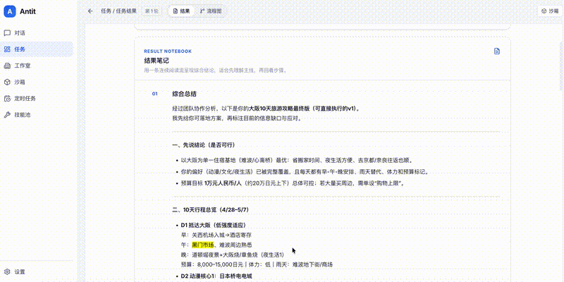
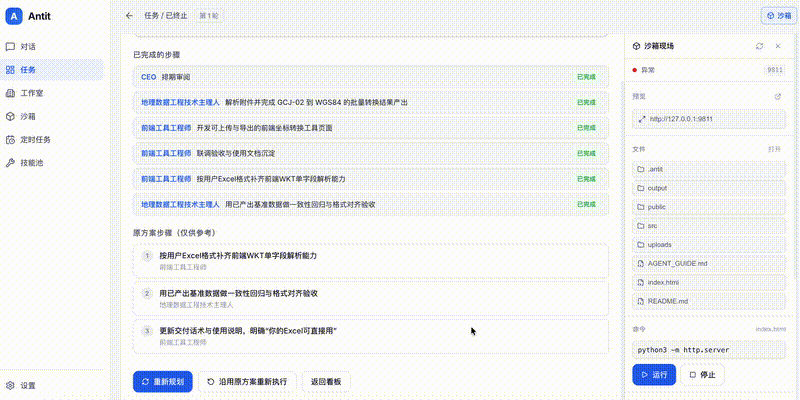

# 这是个什么
这是一个开箱即用（需配置模型）的多Agent应用。让我们舍弃线形的问答，你的任务会由Agent根据具体场景分发给独立的“工作室”，工作室老板会带领他的员工将任务闭环完成之后再呈现给你。

#  想介绍给你的

## 方便使用
CLI或许很酷，但是对于没有技术底子的人来说不太友好，所以Antit直接打包呈现给你，只需要在设置中配置你的模型

## 需求确认与审批
没人想浪费珍贵的Token，但是大部分刚上手AI的朋友们总喜欢用一句话解决一个复杂的问题，例如下图，当给定的需求过于抽象时，Antit会请求你填写一些具体的问题，然后将处理的步骤交给你审批，避免步骤中出现很不合理的点。没问题再开始进行。（当然你也可以不看直接点提交）。

前往补充需求

确认agent将要执行的步骤是否符合你的预期

## 多agent
## 工作室
在大多数情况下，我们没有必要将全部的记忆和上下文统统塞给模型，所以Antit针对各类任务场景引入了工作室的概念，进行了自动化的沉淀。你的任务会由主Agent进行路由，如果没有对应的工作室能处理，则会创建一个该领域的工作室，用来专门处理此类问题。工作室在完成任务后会自动的沉淀**记忆**和**经验**

## 员工
真正执行任务的subagent，由人为/AgentZero自动创建，工作室接到一个任务后，工作室的“老板”会拆分任务，生成多个步骤，根据subagent的特性分配，生成一个DAG并执行。

同时，你也可以手动编辑/创建员工的具体信息（agent.md）和skills

# 结果
## 文本结果
不知道你是否和我一样，经常需要在模型给我的答案中针对某些名词或者不清晰的点进行提问，最终在线形的问题下逐渐迷失，回不到原来的路，我尝试通过批注的方式解决这个问题。

## 工具结果
在某些任务场景下，你期望让模型沉淀一些东西出来，比如一些转换工具，我希望日后能更方便的使用，我尝试使用“沙箱”来解决这个问题，他可以让你很方便的打开你让它做的工具。比如我让他做的坐标转换工具。

